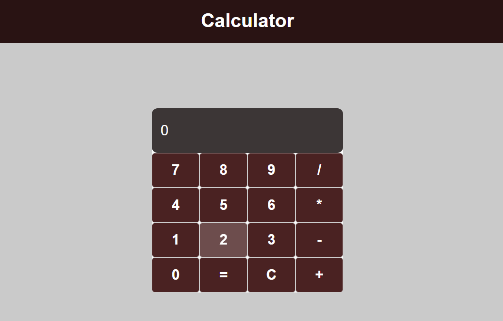

# React Calculator



## Introduction

Welcome to the React Calculator! This project is a simple calculator built using React. It allows users to perform basic arithmetic operations like addition, subtraction, multiplication, and division.

## Features

- **Addition**: Add two numbers.
- **Subtraction**: Subtract one number from another.
- **Multiplication**: Multiply two numbers.
- **Division**: Divide one number by another.
- **Clear**: Clear the current input.
- **Responsive Design**: The calculator is fully responsive and works well on all devices.

## Demo

Check out the live demo [here](https://your-demo-link.com).

## Installation

To run this project locally, follow these steps:

1. **Clone the repository:**
   ```sh
   git clone https://github.com/your-username/react-calculator.git
   cd react-calculator
   ```
2. **Install the dependencies:**
   ```sh
   npm install
   ```
3. **Start the development server:**
   ```sh
   npm start
   ```
4. **Open your browser:**
Navigate to http://localhost:3000 to see the calculator in action.

## Usage
- Click the number buttons to input numbers.
- Use the operator buttons (+, -, *, /) to perform calculations.
- Click the = button to get the result.
- Use the C button to clear the input.

## Technologies Used
- **React:** A JavaScript library for building user interfaces.
- **Styled-components:** For styling the components.

## Contact
- Lucca Malta Freitas - luccamaltafreitas@gmail.com
- Check out my LinkedIn [Here](https://www.linkedin.com/in/luccamf/)

<br/>

#

Thank you for checking out my React Calculator project!